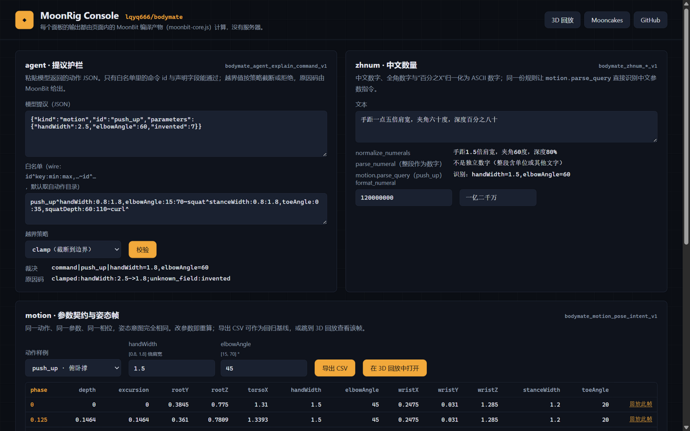
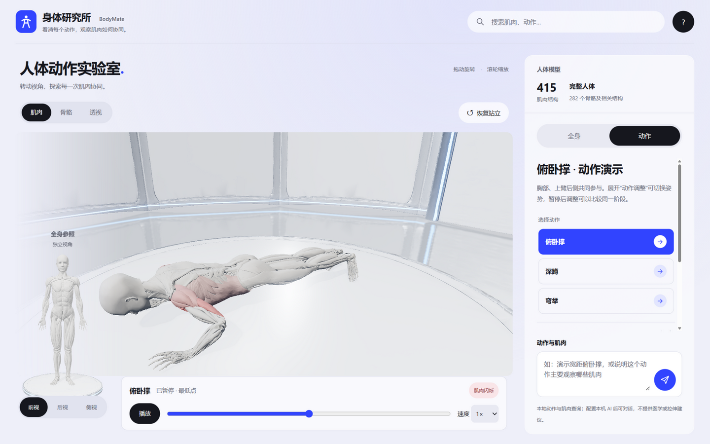

# lqyq666/bodymate｜LLM 工具调用护栏与 MoonBit 库套件

> **English.** A dependency-free MoonBit library that guards LLM tool calls — the model can only invoke commands you declared, with fields you defined, within bounds you set. Anything else is clamped, rejected or silently dropped with a machine-readable reason. Plus a drop-in OpenAI-compatible gateway (`npm run guard:serve`) so any application gets the guard by changing one line: `base_url`. Three companion packages (Chinese numerals, bilingual anatomy terms, parameterized motion sessions) prove the guard is part of a reusable library suite, not a one-off. Published on [mooncakes.io](https://mooncakes.io/docs/lqyq666/bodymate).

`lqyq666/bodymate` 的主体是一个**LLM 工具调用执行护栏**——"模型输出不是执行权限"。宿主声明允许的工具与字段约束，模型提议只能收敛为白名单命令；越界数值被截断或拒绝，非法枚举被丢弃，幻觉工具被整体拒绝，每一步都给出机器可读的原因码。外加三个可单独 `moon add` 的 MoonBit 库（中文数量解析、双语解剖术语、参数化动作会话）证明这是一套可复用的库套件而非一次性工具。



## 30 秒看懂

```moonbit
// moon add lqyq666/bodymate
let allowed = @agent.parse_allowlist("set_light^brightness:0:100,mode?warm?cool?auto~move_robot^distance:0:10,speed?slow?normal?fast")

// 模型返回 set_light({brightness: 200, mode: "disco"})
@agent.explain_command("set_light", [("brightness", @agent.FieldValue::Num(200.0)), ("mode", @agent.FieldValue::Str("disco"))], allowed, Clamp)
// → Command("set_light", [("brightness", Num(100))])       200 被截断到 100
// → reasons: ["clamped:brightness:200->100", "unknown_option:mode:disco"]

// 模型幻觉了 delete_database
@agent.explain_command("delete_database", [], allowed, Clamp).action
// → None                                                  整条拒绝，不猜测
```

## 一行接入：OpenAI 兼容网关

任何 OpenAI SDK 只改 `base_url`，发出的每个 `tool_calls` 响应先过 MoonBit 护栏再回到应用：

```sh
npm run guard:serve          # 启动 127.0.0.1:4175
```

```python
# 应用侧：只需改 base_url
client = OpenAI(base_url="http://127.0.0.1:4175/v1", api_key="your-key")
```

网关从请求的 `tools` 定义（JSON Schema：数值边界、字符串枚举）自动生成护栏白名单；响应中的 `tool_calls` 被逐条校验后改写——截断越界数值、丢弃非法枚举、拒绝幻觉工具名——并在 `x-guard-verdicts` 响应头返回逐条裁决与原因码。

**演示**：`node scripts/demo-guard-interception.mjs --mock`（无需 API Key，完整展示拦截链路）：

```text
用户请求: set_light(200, disco) + move_robot(50, turbo) + delete_database()
应用收到: set_light(100)  +  move_robot(10)  +  guard_rejected(delete_database)
原因码:   clamped:brightness:200->100; unknown_option:mode:disco
         clamped:distance:50->10;       unknown_option:speed:turbo
         unknown_id:delete_database
```

## 四个包

| 包 | 解决的问题 | 谁会用 |
| --- | --- | --- |
| `lqyq666/bodymate/agent` | **LLM 工具调用护栏**：白名单命令 + 带上下界的数值字段 + 枚举选项 + 有界文本；Clamp/Reject 策略；机器可读原因码 | 任何用大模型做工具调用 / Agent / 对话式控制的 MoonBit 或 JavaScript 项目 |
| `lqyq666/bodymate/zhnum` | **中文数量表达**：`三万五千`、`三点一四`、`负`、`半`、`一万亿`、全角数字、`百分之八十` → ASCII 数字；格式化回读 | 中文 UI 指令、语音/聊天输入、配置与表单解析 |
| `lqyq666/bodymate/anatomy` | **Human Atlas / BodyParts3D 双语术语库**：376 条归一化拉丁名 → 中文，含侧别与肌肉优先检索 | 医学、体育、康复教育与可视化项目 |
| `lqyq666/bodymate/motion` | **参数化动作会话引擎**：类型化参数与限幅、中文指令解析（经 zhnum）、独立 `Session`、关键帧标注、确定性姿态意图 | 动作回放工具、动画/仿真状态机 |

四个包都不依赖 DOM、Three.js、GLB、网络或 npm；`agent` 与 `zhnum` 与人体领域无关。

## 生态空缺与竞品

截至 2026-09-16 的调研：

| 维度 | NeMo Guardrails | Guardrails AI | moon_zod / moonschema | **本库** |
| --- | --- | --- | --- | --- |
| 语言/平台 | Python | Python | MoonBit | **MoonBit + JS wire** |
| 工具调用校验 | ✓（Colang 状态机内嵌） | [开放 issue #1601](https://github.com/guardrails-ai/guardrails/issues/1601) | 通用 schema 校验，无动作语义 | ✓ 白名单命令 + Clamp/Reject + 原因码 |
| 可独立复用 | 需要整个框架 | Python 库 | ✓ 但不含策略 | ✓ 无依赖 MoonBit 包 + JS wire 导出 |
| 网关接入 | — | — | — | ✓ `npm run guard:serve`，改一行 base_url |
| MoonBit 生态 | — | — | ✓ | **mooncakes.io 上唯一的工具调用护栏原语** |

Guardrails AI 社区明确在要工具调用校验（issue #1601），NeMo 的实现需要整个 Colang 状态机框架；mooncakes.io 全注册表扫描没有任何同类包。

## 验证

- MoonBit 79 项测试 · Node 149 项测试 · CI 每个 PR 全绿
- `npm run moonbit:package-check`：真实发布 ZIP 在隔离目录 check/build/test/run
- `npm run moonbit:install-check`：从 mooncakes.io 真实 `moon add lqyq666/bodymate@0.4.0` 并运行四个包
- `node scripts/demo-guard-interception.mjs --mock`：完整拦截链路演示（无需 API Key）

## 参考应用：MoonRig Console

[**库工作台（在线）**](https://lqyq666.github.io/bodymate/console.html)：三个面板直接调用页面内 MoonBit 编译产物——agent 面板对模型提议做白名单裁决并给出原因码，zhnum 面板做中文数量归一化并联动 `motion.parse_query`，motion 面板按参数契约重算确定性姿态帧、导出 CSV。

[**3D 回放视图（在线）**](https://lqyq666.github.io/bodymate/?view=full-body)：415 肌肉、282 骨骼及相关结构的参照骨架回放。参数契约、关键帧标注、定性参与映射全部由 MoonBit 会话计算；可选本地 AI 对话（服务端与浏览器同一份护栏规则）。



## 来源、AI 辅助与限制

自有代码 MIT；人体几何保留 Human Atlas / BodyParts3D 的 CC BY 4.0 归属。ChatGPT / Codex / ZCode 参与设计、实现、测试与文档。`anatomy` 是展示译名，不是临床术语标准。不提供医疗诊断、训练处方或实测发力结论。

## 评审入口

- [库说明（四个包的 API、边界、示例）](moonbit/motion/README.md)
- [评委快速开始](docs/REVIEWER_QUICKSTART.md) · [MoonBit 技术审查](docs/MOONBIT_REVIEW_GUIDE.md)
- [在线库工作台](https://lqyq666.github.io/bodymate/console.html)
- [演示讲稿](docs/DEMO_SCRIPT.md) · [一页项目说明](docs/ONE_PAGE_PROJECT.md) · [申报清单](docs/SUBMISSION_CHECKLIST.md)
- [更新日志](CHANGELOG.md) · [参与开发](CONTRIBUTING.md)
