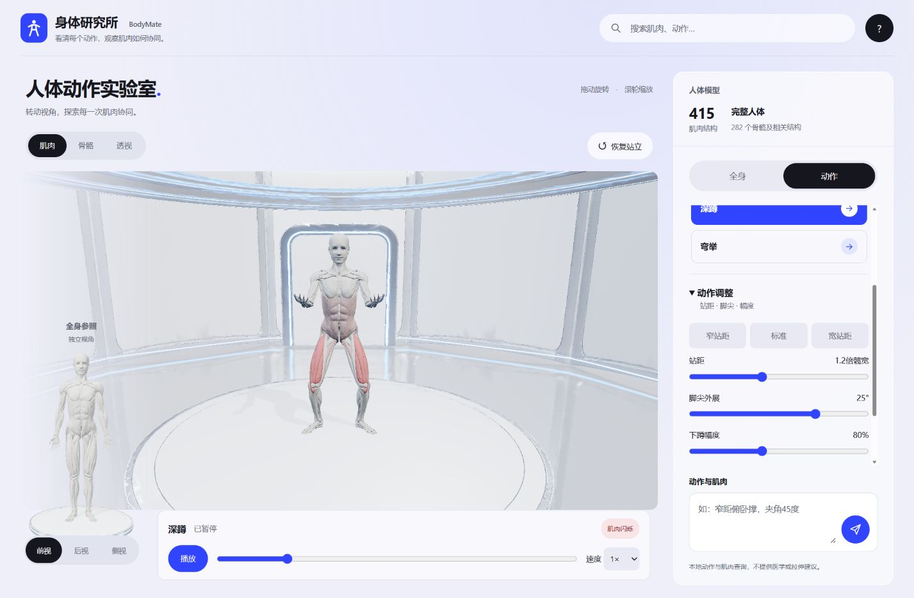

# BodyMate MoonBit 新项目优化验证

日期：2026-09-13。本文记录提交前的本地实现、测试、构建、真实浏览器回归与申报材料；GitHub 后续交付以远端提交记录为准，未发布 Mooncakes 或报名。

## 实现结果

- 从当前全身核心抽出 `moonbit/motion`，保留同一份参数、解析、profile 与 pose 规则；`core` 仅保留 V1 序列化和当前浏览器会话实例。
- 新增类型化 API、显式错误、私有独立 Session、可安全交给调用者的数组副本和公开 `.mbti`。
- 修复非有限 pose phase 产生无效姿态，以及极大有限 delta 在倍速运算中溢出的边界。
- 新增三个独立 MoonBit 示例和八个公共接口黑盒测试；既有浏览器与几何契约继续通过。
- 配置 `.moonignore`，实际 ZIP 仅包含库、测试、示例、接口、文档和许可证；新增隔离包审计。
- 同步 README、架构、评委路线、讲稿、一页说明、新项目申报说明、测试矩阵、复现说明、复盘和状态清单。旧颈肩能力明确标为保留契约。
- 源码统计覆盖所有 MoonBit 包，分离示例、策略、适配器和旧契约；基线过期会使检查失败。

## 本地命令证据

| 命令 | 结果 |
| --- | --- |
| `npm run build` | 成功，全身运行时重新生成 |
| `npm run check` | 47/47 MoonBit、120/120 Node；生成物、公开接口、人体哈希、仓库卫生及统计基线通过 |
| `npm run moonbit:examples` | 参数、双会话、采样三场景含断言运行成功 |
| `npm run moonbit:package-check` | 实际 ZIP 解压后 check/build/test/run 成功，8 个库测试是总测试数的子集 |
| `npm run moonbit:stats` | 生产 2,159 行，测试 533 行，示例 38 行单独统计；库 389、全身策略 348、wire 适配器 134、保留契约 1,288 |

规模是手写有效行，排除空行、纯注释、生成 JS / `.mbti`。抽取与复用本身不意味着要增加行数；不能把旧契约都当成当前全身页面逻辑。

## 浏览器实际回归

Edge，`http://127.0.0.1:4174/?view=full-body`，刷新后操作当前构建：

1. 人体加载完成，页面显示 415 条肌肉及 282 个骨骼/相关结构。
2. “全身→动作”实际启动俯卧撑；暂停后切宽距，手距 1.8、肘角 60°，进度 131/1000 保持，仍显示已暂停。
3. 切深蹲再暂停；宽站距预设更新为 1.8 / 30°，进度 83/1000 保持。
4. 输入“深蹲，脚尖外展25度，深度80%”后页面实际显示脚尖 25°、幅度 80%。这条显式动作命令重新开始播放，不把它与保持暂停的面板参数操作混同。
5. 暂停后速度切换为 1.5×、进度设为 500/1000；骨骼与透视模式正常切换。
6. 切弯举后实际播放；恢复站立返回全身状态，动作播放条退出。
7. 搜索“胸大肌”显示“已高亮 6 个相关肌肉结构”。
8. 当前浏览器日志 error 为 0。截图中中央人体、左侧独立站立参照、环境和参数面板正常显示。

本轮未改变布局、CSS 或资产。此前响应式/UI 回归见 `BODYMATE_UI_REFERENCE_REVIEW_2026-09-13.md`；不把此前截图当成本轮重新执行的手机测试。

## 冻结人体核验

| 文件 | SHA-256 |
| --- | --- |
| `neck-muscles.glb` | `FA6A0CFDDF1DA59367EA8EB72DB77770A08A2F53D01097C2873ECFFD692F7065` |
| `rigged-body.glb` | `CD2E2108F7551B87928989C445C78E8BB35D867C89D90CD766623CB4CF7E1522` |
| `full-muscles.glb` | `03F01F82188C4849BA1A2B270CACD5737629E7AB4CB4B06BFF1BB3E57AF59BAE` |

## 状态与剩余事项

`MODIFIED`、`TESTED`、`BUILT`：是。`ONLINE_VERIFIED`：本地全身页面已验证。`DEPLOYED`：无外部部署。`ACCEPTED`：未获官方验收。

公开仓库优化前基线已读回核验。GitHub 后续交付以远端提交及 CI 记录为准；Mooncakes 实际发布/安装与正式申报另行完成。见 `SUBMISSION_CHECKLIST.md`；不得用旧 RC 标签或历史 CI 代替当前版本证据。
